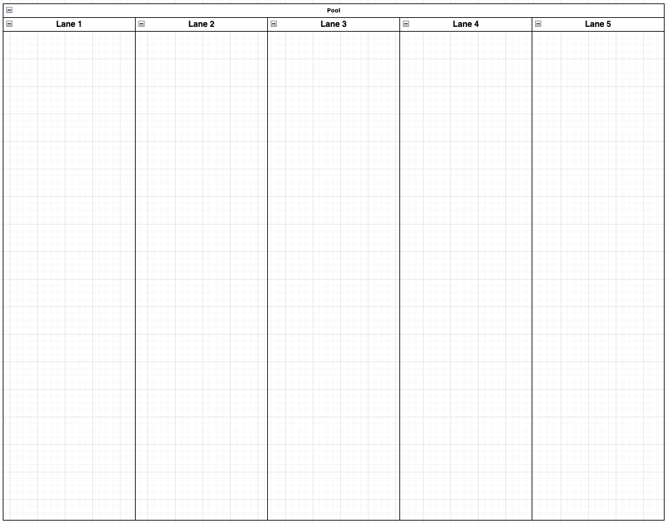

# drawio_wiz

A command-line tool to generate empty draw.io diagrams.

* swimlane diagrams with configurable lanes
* more to come

## Usage

```bash
drawio_wiz swimlane --lanes 5 --out /Users/cubicle-jockey/tmp/test.drawio
```



## Motivation

The desktop version of draw.io does not support extensions, and the built-in templates create fully populated
diagrams.  
To work around this limitation, this tool generates clean, empty draw.io diagrams tailored to my needs.

## Disclaimer

This tool is not affiliated with draw.io or diagrams.net.